# Quak — DuckDB-Powered Spreadsheet

A spreadsheet application powered by DuckDB, where cells can contain both data and interactive UI widgets (dropdowns, checkboxes, date pickers, formulas, rendered markdown) on the same sheet. DuckDB-WASM runs in the browser for instant SQL queries; a Node.js server persists data.


## Features

- **AI Chat Assistant** — natural-language interface powered by LLMs (OpenRouter) with 16 tools including data summarization, sorting, filtering, and conditional formatting
- **Multiple views** — Grid, Kanban, Calendar, Gallery, and Pivot views over the same data
- **Pivot tables** — cross-tabulate data with configurable row/column/value fields and SUM/COUNT/AVG/MIN/MAX aggregation
- **Column freezing** — pin columns to stay visible while scrolling horizontally
- **Conditional formatting** — color-code cells based on value rules (equals, greater than, contains, etc.)
- **Data validation** — enforce required fields, min/max values, regex patterns, and custom lists with visual feedback
- **Row grouping** — group rows by any column with collapsible headers and automatic subtotals
- **7 cell types** — text, numbers, checkboxes, dropdowns, date pickers, formulas, and markdown all in one sheet
- **In-browser SQL** — query your spreadsheet data with DuckDB-WASM, with syntax highlighting and query templates
- **Charts** — visualize query results as bar, line, or pie charts
- **Import & export** — drag-and-drop CSV, TSV, or JSON files; export as CSV or JSON
- **Search & filtering** — full-text search, per-column floating filters, multi-column sort
- **Undo & redo** — full action stack (50 levels) for cell edits, row ops, and column changes
- **Query history** — automatic history with pinned/saved queries
- **Sheet templates** — Task Tracker, Budget, and custom templates to start fast
- **Dark mode** — three-state theme toggle (light/dark/system) with smooth transitions, FOUC prevention, and AG Grid theme switching
- **Keyboard shortcuts** — Ctrl+Z/Y, Ctrl+F, Ctrl+Enter, and more
- **Responsive** — mobile-friendly layout with bottom navigation, AI button, and slide-over sidebar

<details>
<summary>View Screenshots</summary>

### Grid View

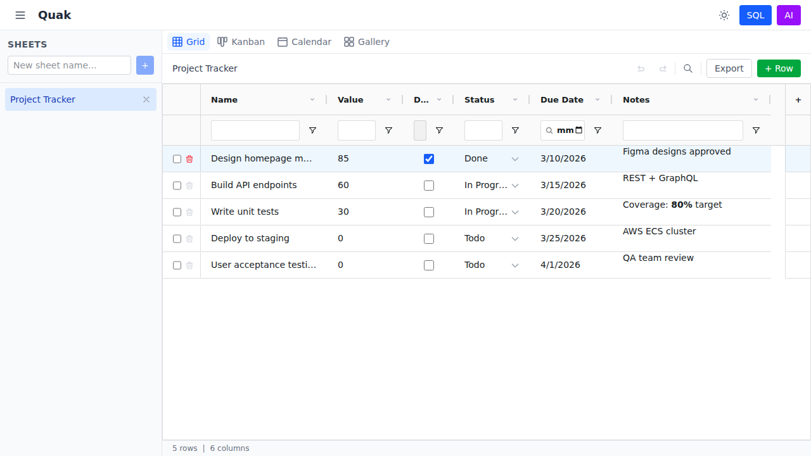

### Kanban View

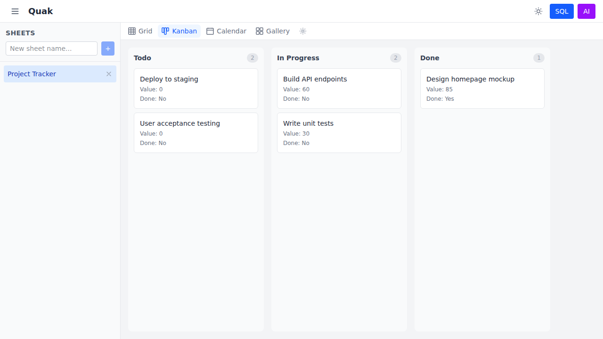

### Calendar View

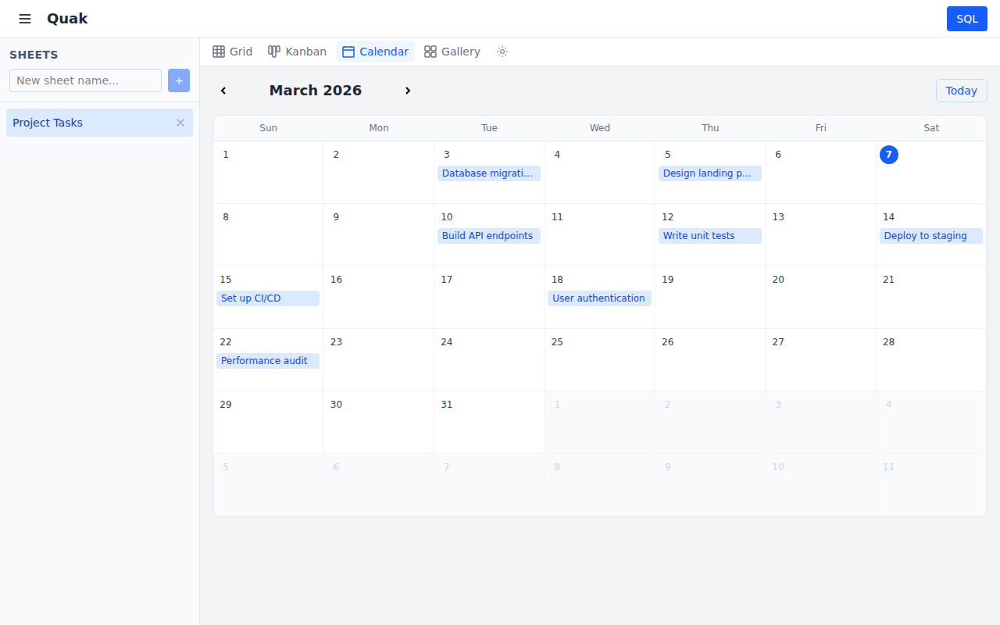

### Gallery View

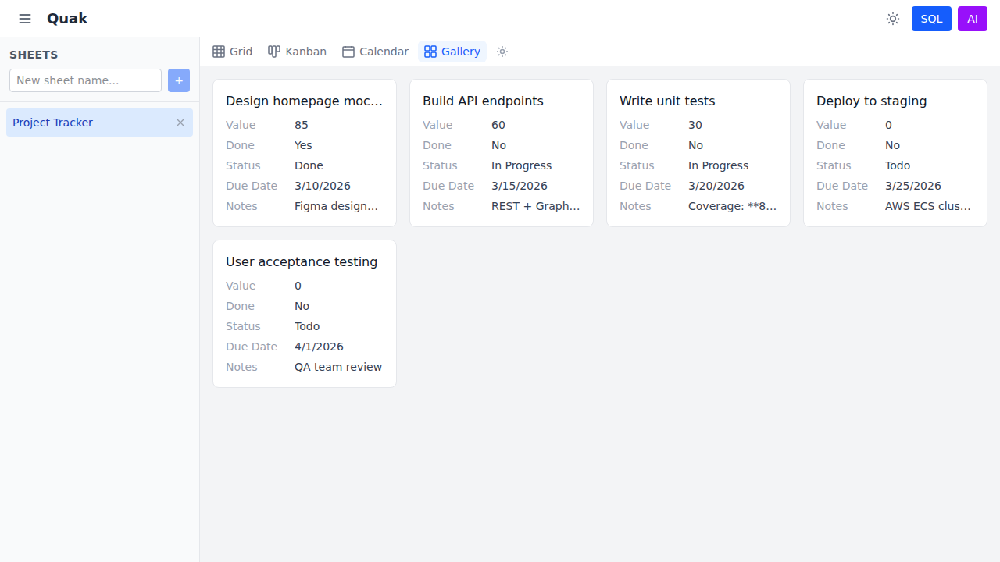

### Conditional Formatting

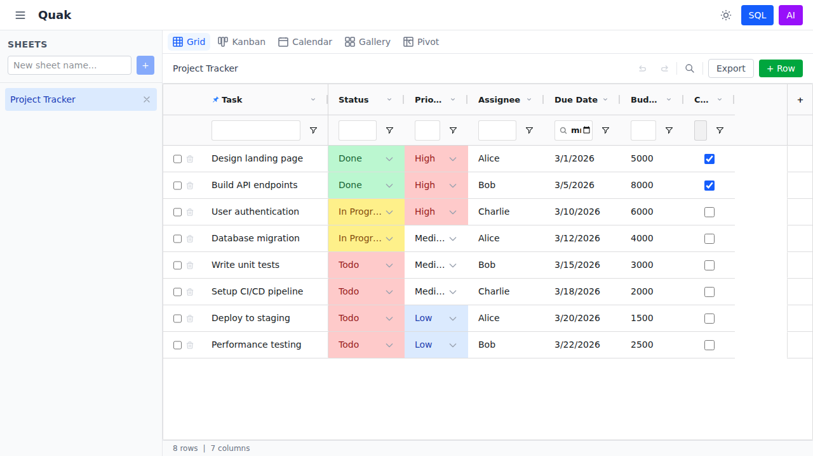

### Row Grouping

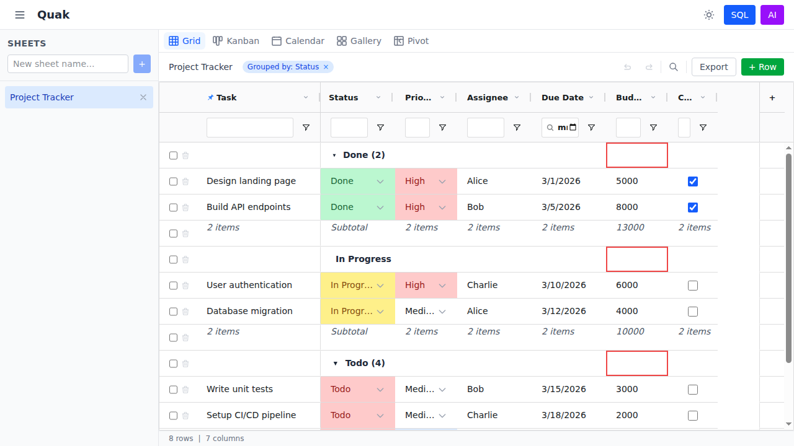

### Pivot Table

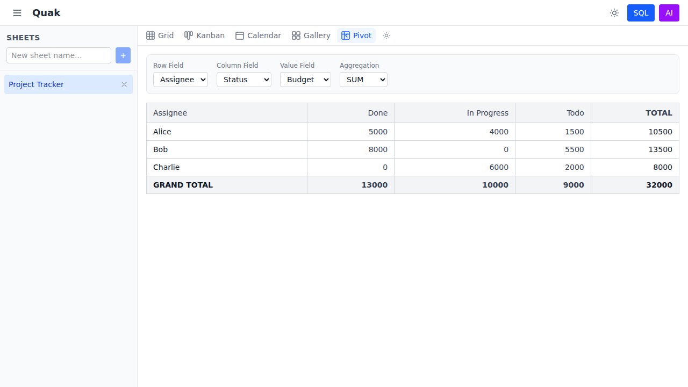

### AI Chat Assistant

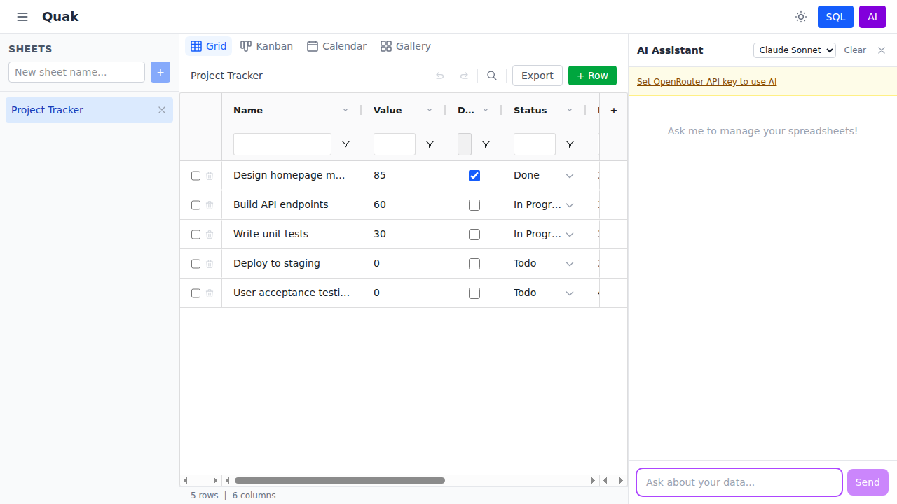

### Dark Mode

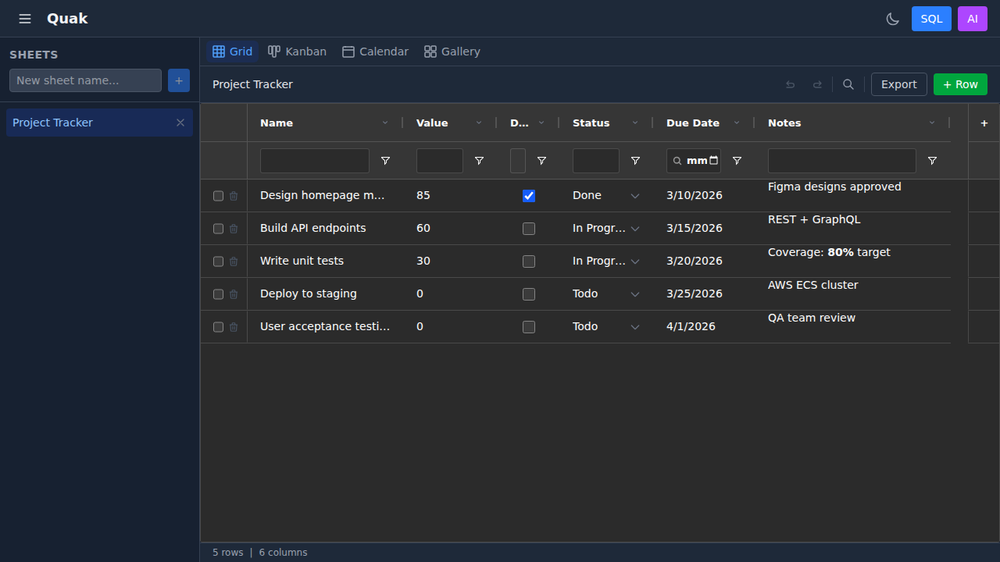

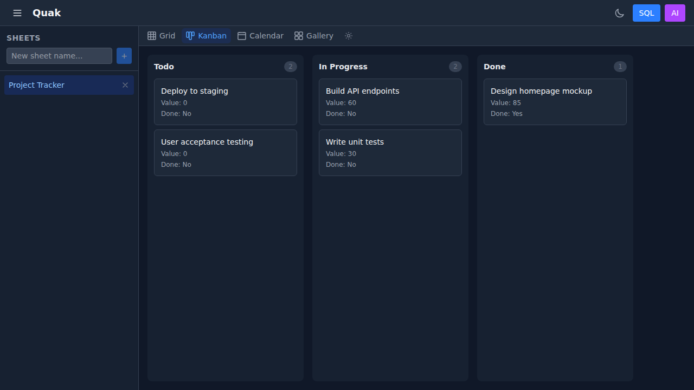

### Mobile

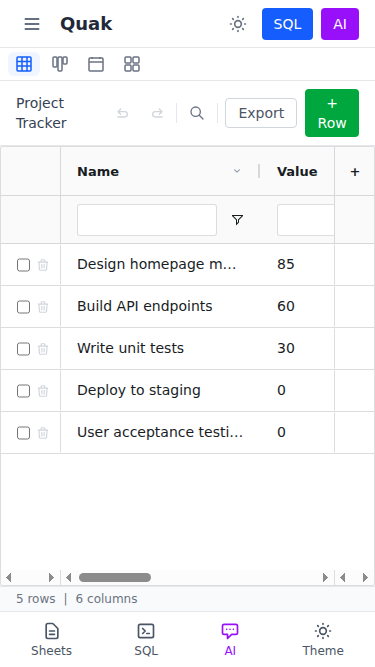
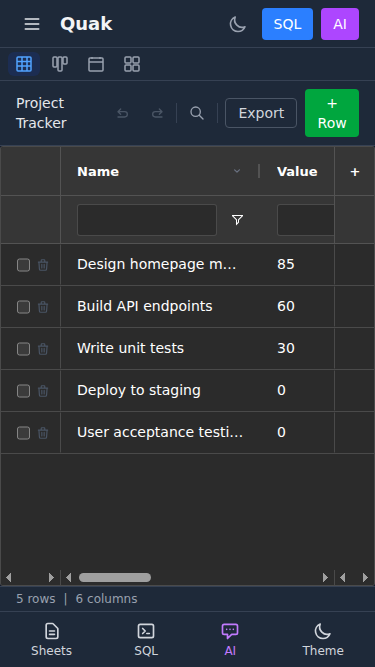

</details>

## Tech Stack

| Layer | Technology |
|-------|------------|
| Frontend | React 19 + TypeScript + Vite 6 |
| Grid | AG Grid Community v35 |
| Styling | Tailwind CSS 4 |
| State | Zustand 5 |
| Client DB | DuckDB-WASM (in-browser SQL) |
| Charts | Recharts 3.8 |
| Server | Express 4 + @duckdb/node-api |
| Tests | Vitest (unit) + Playwright (E2E) |

## Quick Start

```bash
npm install
npm run dev
```

This starts both the Express server (port 3001) and Vite dev server (port 5173). Open http://localhost:5173.

Or use the Makefile:

```bash
make dev        # Start both servers (kills existing first)
make kill       # Stop all running processes
make status     # Show running processes and port status
```

## Documentation

Full feature documentation is available as a VitePress site:

```bash
npm run docs:dev
```

Then open http://localhost:5173 to browse the docs, including:

- [Multiple Views](docs/features/views.md) — Grid, Kanban, Calendar, Gallery, and Pivot
- [Pivot Tables](docs/features/pivot-tables.md) — cross-tabulation with aggregation
- [Column Freezing](docs/features/column-freezing.md) — pin columns for horizontal scrolling
- [Conditional Formatting](docs/features/conditional-formatting.md) — color-code cells by value
- [Data Validation](docs/features/data-validation.md) — enforce data quality rules
- [Row Grouping](docs/features/row-grouping.md) — group rows with subtotals
- [Cell Types](docs/features/cell-types.md) — all 7 types with usage details
- [SQL Queries](docs/features/sql-queries.md) — query panel, templates, and history
- [Charts](docs/features/charts.md) — bar, line, and pie visualization
- [Import & Export](docs/features/import-export.md) — file formats and type inference
- [Search & Filtering](docs/features/search-filtering.md) — search, filters, and sorting
- [AI Chat Assistant](docs/features/ai-chat.md) — natural-language data management with tool calling
- [Dark Mode](docs/features/dark-mode.md) — light, dark, and system theme with smooth transitions
- [Architecture](docs/architecture.md) — dual-DuckDB architecture and data flow

## Project Structure

```
quak/
├── shared/          # Shared types & constants
├── client/          # React frontend
│   ├── db/          # DuckDB-WASM setup
│   ├── api/         # Server API calls
│   ├── store/       # Zustand stores (sheet, UI, undo, query, chat, toast)
│   ├── hooks/       # Custom hooks
│   └── components/  # UI components
│       ├── layout/  # AppShell, Header, Sidebar, MobileNav
│       ├── grid/    # SpreadsheetGrid, GridToolbar, StatusBar
│       ├── views/   # ViewContainer, Kanban, Calendar, Gallery
│       ├── cells/   # CellRouter + per-type renderers
│       ├── chat/    # AI chat panel + tool call cards
│       ├── query/   # SQL panel, charts, history, templates
│       └── import/  # File import dialog
├── server/          # Express backend + DuckDB storage + LLM integration
├── tests/           # Unit (Vitest) + E2E (Playwright)
└── docs/            # VitePress documentation site
```

## Cell Types

| Type | Description |
|------|-------------|
| Text | Standard text input |
| Number | Numeric values (right-aligned) |
| Checkbox | Toggle on/off with a click |
| Dropdown | Select from predefined options |
| Date | Native date picker |
| Formula | Computed column with SQL expressions (fx badge) |
| Markdown | Rich text with GFM support |

## Testing

```bash
make test           # All tests (unit + E2E)
make test-unit      # Unit tests only (Vitest, 11 files)
make test-e2e       # E2E tests only (Playwright, 20 files)
make test-file F=query  # Single E2E test file
make check          # Quick: typecheck + unit
make verify         # Full: typecheck + unit + E2E
```

## License

MIT
