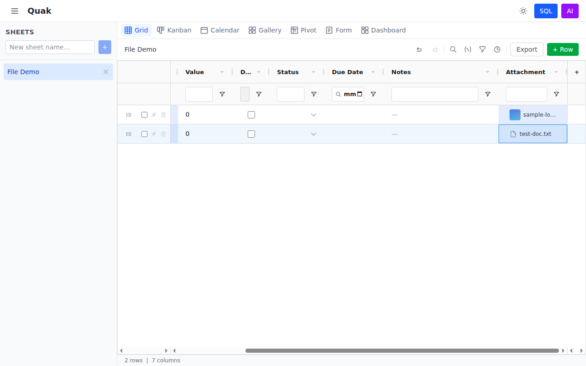
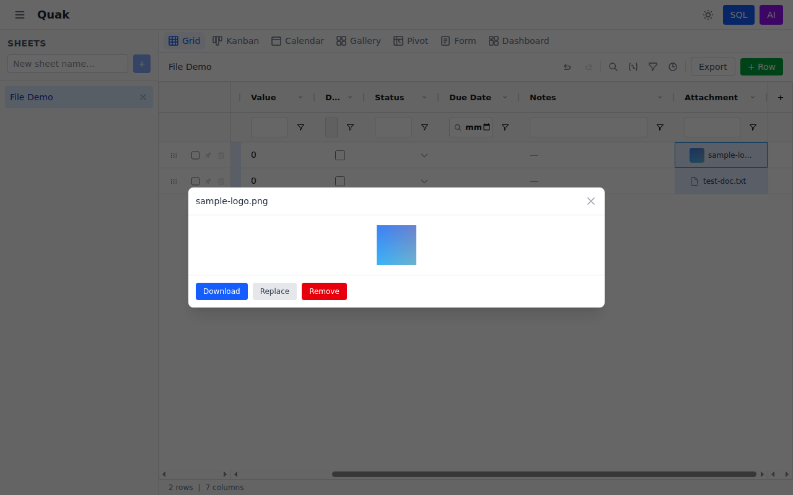

# Cell Types

Every column in Quak has a type that determines how cells are rendered and edited. You can mix any combination of column types on a single sheet.

## Available Types

### Text

Standard text input. Click a cell to type. Supports any string value.

### Number

Numeric input with validation. Non-numeric values are rejected. Displayed right-aligned.

### Checkbox

Boolean toggle rendered as a clickable checkbox. Click to toggle between checked and unchecked. Stored as `true`/`false`.

### Dropdown

Select from a predefined list of options. When creating or editing a dropdown column, you define the available choices (e.g., "Critical", "High", "Medium", "Low"). Cells display a select menu on click.

### Date

Native date picker. Click a cell to open the browser's date picker UI. Dates are stored in `YYYY-MM-DD` format.

### Formula

Computed columns powered by SQL expressions. Define a formula like `Value * 2` or `CASE WHEN Done = true THEN 'Complete' ELSE 'Pending' END`, and the cell value is calculated dynamically. Formula cells display an **fx** badge to indicate they are computed.

::: info How Formulas Work
Formula columns create a temporary DuckDB table from your sheet data and evaluate the SQL expression for each row. This means you can use any DuckDB SQL function in your formulas.
:::

### Markdown

Rich text with GitHub Flavored Markdown support. Cells render:

- **Bold**, *italic*, ~~strikethrough~~
- `inline code` and code blocks
- Bulleted and numbered lists
- GFM task checkboxes (`- [x] done`, `- [ ] todo`)
- Links and images

### Linked Record

References a row from another sheet. When adding a linked record column, select the target sheet and the display column. Cells show a dropdown of available rows from the linked sheet. Stored as the linked row's ID (`INTEGER`).

### Lookup

Auto-pulls a value from a linked sheet. Select which linked record column to follow and which field to return. Lookup columns are read-only and computed automatically. Useful for displaying related data without duplicating it.

### File

Upload images, PDFs, and documents directly into cells. Supports jpg, png, gif, webp, pdf, doc, docx, xls, xlsx, csv, and txt files up to 10MB.

- **Empty cells** show an upload prompt — click to open the file picker
- **Image files** display a thumbnail and filename — click to open a preview modal with Download, Replace, and Remove actions
- **Document files** display a file icon and filename — click to download

## Changing Column Types

Right-click any column header (or click the menu icon) to:

- **Rename** the column
- **Change type** to any of the 10 types above
- **Delete** the column (with confirmation)

When changing types, existing data is preserved where possible. For example, switching a text column containing "true"/"false" to checkbox will map the values correctly.

## Adding Columns

Click the **+** button in the grid toolbar to add a new column. You'll be prompted for:

1. **Column name**
2. **Column type** (one of the 10 types above)
3. **Options** (for dropdown columns — comma-separated list)

## Summary Table

| Type | Input | Display | Storage |
|------|-------|---------|---------|
| Text | Free text | Plain text | `VARCHAR` |
| Number | Numeric only | Right-aligned number | `DOUBLE` |
| Checkbox | Click toggle | Checkbox widget | `BOOLEAN` |
| Dropdown | Select menu | Selected option text | `VARCHAR` |
| Date | Date picker | Formatted date | `DATE` |
| Formula | SQL expression (on column config) | Computed value with fx badge | Expression string |
| Markdown | Free text (markdown syntax) | Rendered HTML | `VARCHAR` |
| Linked Record | Select from linked sheet | Display column value | `INTEGER` |
| Lookup | Automatic (read-only) | Value from linked sheet | Computed |
| File | File picker (click cell) | Thumbnail or file icon | `VARCHAR` (JSON) |
